# Masoud Masoori

**AI Safety & Security Researcher · Agentic AI Architect**
**Founder & CEO — [MAS-AI Technologies Inc.](https://mas-ai.co)** *(incorporated Ontario, Jan 2026)*

Building **[Daena](https://daena.mas-ai.co)** — the governance layer for autonomous AI agents.
Researching adversarial robustness in open-source agent ecosystems (OpenClaw, NVIDIA NemoClaw).

📍 Richmond Hill, Ontario, Canada

---

## 🛡️ Mission

> **Reduce catastrophic risk from advanced AI by making autonomous agents safe, interpretable, and steerable — at production scale, not in slideware.**

Most agent platforms ship hot-path LLM calls with no immutable guardrails. Daena inverts that: **every agent action passes through a 10-stage deterministic pipeline** — SecurityGate, InputValidator, GovernanceEngine, ContextBuilder, ReasoningCore, ActionPlanner, OutputValidator, ResponseFormatter, FeedbackLoop, AuditLog — with a Merkle-notarized audit trail and a 9-law immutable governance core that no agent, user, or LLM output can override.

---

## 📊 Daena at a Glance

| Dimension | Status |
|:---|:---|
| 🧪 **Test Suite** | **1,424 / 1,424 passing**, 0 TypeScript errors |
| 🤖 **Agent Fleet** | **60 unified agents × 6 capabilities** across **10 departments** |
| 🧠 **LLM Routing** | **9 providers**: OpenAI · Claude · Gemini · DeepSeek · Qwen · Mistral · Yi · Ollama · Azure OpenAI |
| 📜 **Patents Filed** | **2 USPTO Provisionals** (PhiLattice + NBMF/TLM/eDNA/Dream Engine) |
| ⚡ **Token Efficiency** | **87.5% overhead reduction** per session via Tool Lifecycle Manager |
| 🧬 **Memory Architecture** | **NBMF — 5 tiers** (T0 Working → T4 Permanent) with hallucination auto-expiry |
| 🏆 **Programs** | **Google for Startups** (Accepted '26) · **Consensus Hong Kong 2026** Developer Pass |
| 💰 **Business Model** | BYOK with **75–82% gross margins** · FREE / PRO / ENTERPRISE tiers |

---

## 🏗️ Architecture Snapshot

```mermaid
flowchart LR
    U([User / Agent Caller]) --> SG[🛡️ SecurityGate]
    SG --> IV[InputValidator]
    IV --> GE[GovernanceEngine<br/>9 immutable laws]
    GE --> CB[ContextBuilder<br/>NBMF T0–T4 recall]
    CB --> RC[ReasoningCore<br/>Standard / Council / Quintessence]
    RC --> AP[ActionPlanner]
    AP --> OV[OutputValidator]
    OV --> RF[ResponseFormatter]
    RF --> FL[FeedbackLoop<br/>eDNA Merkle lineage]
    FL --> AL[(AuditLog<br/>tamper-evident)]
    AL --> R([Response])

    style SG fill:#D4A843,stroke:#0F1419,color:#0F1419
    style GE fill:#2DD4BF,stroke:#0F1419,color:#0F1419
    style RC fill:#6C3AFF,stroke:#0F1419,color:#FFFFFF
    style AL fill:#0F1419,stroke:#D4A843,color:#D4A843
```

Three reasoning modes — **Standard** (single primary mind), **Council** (3-model parallel synthesis), **Quintessence** (Council + 15 Domain Context Pack expert lenses with anonymized Karpathy-style peer review).

---

## 📜 Intellectual Property — USPTO Provisionals Filed

<table>
<tr>
<td width="50%">

### 🌻 PhiLattice Architecture
**(Sunflower-Honeycomb)**

`USPTO Provisional #63/877,082`
`Confirmation #1142 · Filed Sept 2025`

Fibonacci-derived hexagonal topology for scalable agent placement. Golden-angle spacing produces optimal information flow + ABAC governance tiers + consensus learning + Merkle-notarized audit lineage.

**25 claims · 11 figures · 1,112 reference numerals**

</td>
<td width="50%">

### 🧬 NBMF + TLM + eDNA + Dream Engine
**(Neural-Backed Memory Fabric stack)**

`USPTO Provisional #64/020,421`
`Confirmation #7683 · Filed March 2026`

5-tier neural-backed memory fabric · 87.5% token-reduction Tool Lifecycle Manager · Experience DNA with tamper-evident Merkle lineage · autonomous 6-phase Dream Engine consolidation.

**14 claims · 20 figures**

</td>
</tr>
</table>

---

## 🚀 Projects & Inventions

### Flagship

<table>
<tr>
<td width="33%" align="center">

#### [🛡️ Daena](https://github.com/Mas-AI-Official/daena)
**Governed AI Orchestration Platform**
10-stage pipeline · 60 agents
1,424 tests · v3.6

</td>
<td width="33%" align="center">

#### [🔀 MergeLoop](https://github.com/Mas-AI-Official/MergeLoop)
**Host-Agnostic Model Council**
Run multi-model synthesis across MCP, CLI & API workers

</td>
<td width="33%" align="center">

#### [🧠 Vibe Agent](https://github.com/Mas-AI-Official/vibe-agent)
**Visual Agent Builder**
Vibe-code your agent → see the blueprint → deploy

</td>
</tr>
</table>

### Research & Security

<table>
<tr>
<td width="50%">

#### [🔍 Klyntar](https://github.com/Mas-AI-Official/klyntar)
Security-AI vulnerability finder. Open-source agent-ecosystem safety research applied to OpenClaw (247K+ stars) and NVIDIA NemoClaw — prompt injection, skill-registry poisoning, credential exposure, unvetted skill execution.

</td>
<td width="50%">

#### [⚖️ CaseWright](https://github.com/Masoud-Masoori/casewright)
AI paralegal for Canadian administrative tribunals. Wedge: Ontario Landlord & Tenant Board. Governed legal-document drafting on top of Daena.

</td>
</tr>
</table>

### Applications Built on Daena

| Project | What it does | Stack |
|---|---|---|
| [🎬 ContentOps Core](https://github.com/Mas-AI-Official/contentops-core) | Autonomous multi-platform, multi-niche content engine — scrape → generate → schedule → publish |   |
| [🌐 ContentOps Web](https://github.com/Mas-AI-Official/contentops-web) | Approval-queue dashboard for ContentOps drafts and rejections |  |
| [💻 Daena Coder](https://github.com/Mas-AI-Official/Daena-Coder) | Free multi-LLM local swarm — governed code assistance with security-aware output validation |  |
| [🎥 LingoVids](https://github.com/Mas-AI-Official/lingovids) | AI video translator under the MAS-AI portfolio |  |
| [🩺 MedScan](https://github.com/Masoud-Masoori/MedScan) | Medical scanner & prescription-reminder system |  |
| [🌿 NatureNLP](https://naturenlp.mas-ai.co) | Nature-inspired NLP — ~2.4× token throughput, 35% lower perplexity vs GPT-2 baseline |  |
| [🤖 AI Autonomous Company OS](https://github.com/Mas-AI-Official/AI-Autonomus-company-OS) | AI-native company operating system | *In development* |
| [💼 Daena Auto-Apply](https://github.com/Mas-AI-Official/daena-auto-apply) | Apply for jobs with AI + local LLMs automatically |  |

### Demos & Showcases

| Demo | Audience |
|---|---|
| [🪙 Daena DeFi Demo](https://github.com/Mas-AI-Official/hackathon_demo) | Hackathon — Daena governance applied to DeFi |
| [🎤 Daena Live Demo](https://github.com/Mas-AI-Official/Daena-live-demo) | Investors & partners — interactive walkthrough |
| [🌐 MAS-AI Site](https://github.com/Mas-AI-Official/Mas-AI-Official) | Company website |
| [📈 Daena Investor Site](https://github.com/Mas-AI-Official/Daena-website) | Daena product landing page |

---

## 🧰 Tech Stack

**Languages**

**AI / Agentic**

**Backend & Data**

**Frontend**

**Cloud & Infrastructure**

**Security & Governance**

---

## 🔬 Research Interests

- **AI safety & alignment** in multi-agent systems
- **Adversarial robustness** + prompt-injection defense in agentic architectures
- **Hallucination detection, containment, auto-expiry** (NBMF trust-gated promotion)
- **Tamper-evident lineage** for AI decision tracking (eDNA + Merkle)
- **Scalable oversight** of LLM-powered agent fleets (9-law immutable governance)
- **Memory safety** + trust-gated information flow in AI systems
- **Open-source agent safety** research on OpenClaw / NVIDIA NemoClaw ecosystems
- **AI-driven cybersecurity** — autonomous threat detection, anomaly classification

---

## 🎓 Background

| | |
|:---|:---|
| 🎓 **Graduate Certificate · Artificial Intelligence (AIG)** | Seneca College, Toronto, ON · 2025 |
| 🎓 **M.Sc. Civil Engineering — Transportation** | Tehran, Iran · 2020 |
| 🎓 **Professional Certificate · Computer Systems Technology** | Tehran College · 2020 |
| 🏅 **Anthropic Academy** | Claude API Fundamentals · MCP · Claude Code · AI Fluency *(2025–26)* |
| ☁️ **AWS Cloud Practitioner** | Cloud + Security · 2025 |
| 🛡️ **Cisco** | Introduction to Cybersecurity · 2024 |
| 🐍 **University of Michigan** | Python for Everybody · Programming for Everybody *(2024)* |

Civil-engineering origin → robotics (ROS1/ROS2, Gazebo, JetAuto) → deep learning (CNNs, ResNet-18, CIFAR-10) → full-stack → governed agentic systems. Built Daena solo from architecture through 1,424 passing tests, 2 patent filings, and 25+ public repos across the [MAS-AI org](https://github.com/Mas-AI-Official).

---

## 🔗 Connect

<table>
<tr>
<td>

**Company**
[mas-ai.co](https://mas-ai.co)

</td>
<td>

**Product**
[daena.mas-ai.co](https://daena.mas-ai.co)

</td>
<td>

**Org**
[github.com/Mas-AI-Official](https://github.com/Mas-AI-Official)

</td>
</tr>
<tr>
<td>

**LinkedIn**
[masoud-masoori](https://www.linkedin.com/in/masoud-masoori/)

</td>
<td>

**X / Twitter**
[@masoud_masoori](https://x.com/masoud_masoori)

</td>
<td>

**Email**
[masoud.masoori@mas-ai.co](mailto:masoud.masoori@mas-ai.co)

</td>
</tr>
</table>

---

### 📈 GitHub Activity

 

**`2,038 contributions in the last year`** · **`1,245 in 2025`** · **`25+ public repos shipped`**

---

> *"Make AI systems safe, interpretable, and steerable — at the speed of execution, not at the speed of approval queues."*
> — **Masoud Masoori**, MAS-AI Technologies Inc.

