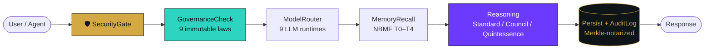

# Masoud Masoori

**AI Safety & Security Researcher · Agentic AI Architect**
**Founder & CEO — [MAS-AI Technologies Inc.](https://mas-ai.co)** *(incorporated Ontario, January 2026)*

Building **[Daena](https://daena.mas-ai.co)** — the governed AI control plane for autonomous agents.

📍 Richmond Hill, Ontario, Canada

📜 [2 USPTO provisional patents](#-intellectual-property--uspto-provisionals-filed) · 🚀 [Google for Startups '26](https://mas-ai.co) · 🎓 Anthropic Academy · 🧪 3,086 backend tests passing

---

## 🛡️ What I'm building

> **Daena is a governed AI control plane: every agent action passes through a 10-stage deterministic pipeline — SecurityGate → GovernanceCheck → ModelRouter → MemoryRecall → LLMStream → Merkle-notarized AuditLog — before it executes.**

Most agent platforms ship hot-path LLM calls with no immutable guardrails; Daena inverts that. It runs **10 departments × 6 capabilities = 60 governed agent slots** over **9 hot-swappable LLM runtimes**, with three always-on governance layers (Shield · Security · Asset Shield) and user-controlled modes from **UNLEASHED** to fully **GOVERNED**. Research focus: adversarial robustness, prompt-injection defense, hallucination containment with auto-expiry, and tamper-evident decision lineage in open-source agent ecosystems.

```mermaid
flowchart LR
    U([User / Agent]) --> SG[🛡️ SecurityGate]
    SG --> GC[GovernanceCheck<br/>9 immutable laws]
    GC --> MR[ModelRouter<br/>9 LLM runtimes]
    MR --> MC[MemoryRecall<br/>NBMF T0–T4]
    MC --> RC[Reasoning<br/>Standard / Council / Quintessence]
    RC --> PA[(Persist + AuditLog<br/>Merkle-notarized)]
    PA --> R([Response])

    style SG fill:#D4A843,stroke:#0F1419,color:#0F1419
    style GC fill:#2DD4BF,stroke:#0F1419,color:#0F1419
    style RC fill:#6C3AFF,stroke:#0F1419,color:#FFFFFF
    style PA fill:#0F1419,stroke:#D4A843,color:#D4A843
```

---

## 📜 Intellectual Property — USPTO Provisionals Filed

<table>
<tr>
<td width="50%">

### 🌻 PhiLattice Architecture

`USPTO Provisional #63/877,082`
`Confirmation #1142 · Filed Sept 2025`

Fibonacci-derived hexagonal topology for scalable agent placement. Golden-angle spacing produces optimal information flow + ABAC governance tiers + consensus learning + Merkle-notarized audit lineage.

**25 claims · 11 figures**

</td>
<td width="50%">

### 🧬 NBMF + TLM + eDNA + Dream Engine

`USPTO Provisional #64/020,421`
`Confirmation #7683 · Filed March 2026`

5-tier Neural-Backed Memory Fabric · token-reduction Tool Lifecycle Manager (up to 87.5% measured) · Experience DNA with tamper-evident Merkle lineage · autonomous 6-phase Dream Engine consolidation.

**14 claims · 20 figures**

</td>
</tr>
</table>

---

## 🚀 Projects

> 🏢 **Most of MAS-AI's work lives in the [MAS-AI organization](https://github.com/Mas-AI-Official)** — including the patent-pending Daena core (private). What's here is a curated slice.

| Project | What it does |
|---|---|
| [🛡️ Daena](https://github.com/Mas-AI-Official/daena) | Governed AI orchestration platform — multi-runtime, multi-agent, governance-first |
| [🔌 Switchboard](https://github.com/Mas-AI-Official/mcp-switchboard) | Local-first governed MCP aggregator — one endpoint for Claude, ChatGPT, Cursor & your agents. `Apache-2.0` |
| [🎬 ContentOps](https://github.com/Masoud-Masoori/contentops) | Autonomous multi-platform content engine — scrape → generate → schedule → publish. `Apache-2.0` |
| [🔀 MergeLoop](https://github.com/Mas-AI-Official/MergeLoop) | Host-agnostic model council for MCP, CLI, and API workers |
| [💻 Daena Coder](https://github.com/Mas-AI-Official/Daena-Coder) | Free multi-LLM local swarm — governed code assistance with security-aware validation |
| [🌐 ContentOps Web](https://github.com/Mas-AI-Official/contentops-web) | Approval-queue dashboard for ContentOps drafts and rejections |
| [🌿 NatureNLP](https://naturenlp.mas-ai.co) | Nature-inspired NLP — ~2.4× token throughput, 35% lower perplexity vs GPT-2 baseline |
| [🩺 MedScan](https://github.com/Masoud-Masoori/MedScan) | Medical scanner & prescription-reminder system |
| [🎥 LingoVids](https://github.com/Mas-AI-Official/lingovids) | AI video translator |
| [🪙 Daena DeFi Demo](https://github.com/Mas-AI-Official/hackathon_demo) | Daena governance applied to DeFi (hackathon showcase) |
| [🎤 Daena Live Demo](https://github.com/Mas-AI-Official/Daena-live-demo) | Interactive Daena walkthrough for investors and partners |

**Hackathons & independent builds:** [🏥 Transition Pilot](https://github.com/Masoud-Masoori/transition-pilot) (FHIR-native discharge auditor, Devpost Agents Assemble 2026) · [🏠 CompMemo](https://github.com/Masoud-Masoori/compmemo) (real-estate comp ranking with citations, KV Capital Hackathon) · [🛡️ ModNote](https://github.com/Masoud-Masoori/modnote) (Reddit Devvit removal-explanation composer) · [🌅 MorningMythos](https://github.com/Masoud-Masoori/morning-mythos) (family routine optimizer, EN/中文/ES)

---

## 💼 Three Ways to Engage

<table>
<tr>
<td width="33%" align="center">

#### 🛠️ Product
**Self-Serve SaaS**
[daena.mas-ai.co](https://daena.mas-ai.co)

Governed multi-agent orchestration with FREE / PRO / ENTERPRISE tiers. Hosted, tenant-isolated, audit-logged.

</td>
<td width="33%" align="center">

#### ⚙️ Automation
**Done-With-You**
[mas-ai.co](https://mas-ai.co)

Integrate your existing job, workflow, or department with Daena agents and external LLMs. Ships running, with playbook + SOP.

</td>
<td width="33%" align="center">

#### 🧭 Consulting
**Done-For-You Strategic**
[mas-ai.co/book](https://mas-ai.co/book)

AI-readiness audits, governance design, agent architecture for regulated industries. Built on the patent stack (PhiLattice + NBMF).

</td>
</tr>
</table>

---

## 🎓 Background

| | |
|:---|:---|
| 🎓 **Graduate Certificate · Artificial Intelligence (AIG)** | Seneca College, Toronto, ON · 2025 |
| 🎓 **M.Sc. Civil Engineering — Transportation** | Tehran, Iran · 2020 |
| 🏅 **Anthropic Academy** | Claude API Fundamentals · MCP · Claude Code · AI Fluency *(2025–26)* |
| ☁️ **AWS Cloud Practitioner** | Cloud + Security · 2025 |
| 🛡️ **Cisco** | Introduction to Cybersecurity · 2024 |

Civil-engineering origin → robotics (ROS1/ROS2, Gazebo) → deep learning → full-stack → governed agentic systems. Built Daena solo from architecture through **3,086 passing backend tests** and **2 USPTO patent filings**, with most active development in the [MAS-AI org](https://github.com/Mas-AI-Official).

---

### 📈 GitHub Activity

 

**Contact:** [masoud.masoori@mas-ai.co](mailto:masoud.masoori@mas-ai.co) · [LinkedIn](https://www.linkedin.com/in/masoud-masoori/) · [MAS-AI org](https://github.com/Mas-AI-Official)

> *"Make AI systems safe, interpretable, and steerable — at the speed of execution, not at the speed of approval queues."*

